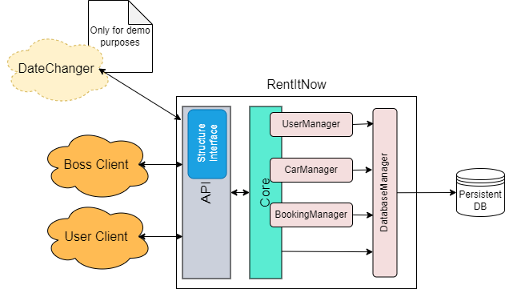

# Setup

```shell
git clone https://github.com/RaffaeleBerzoini/RentItNow
cd RentItNow
mkdir build
cd build
cmake ..
cmake --build . --config Debug
cmake --build . --config Release
```

# Run

```shell
cd .\bin\Release
.\RentItNow.exe
.\UnitTests.exe
```

Or download the release from the [release page](https://github.com/RaffaeleBerzoini/RentItNow/releases)

# Some notes

## RentItNow Architecture


The database manager is thread safe, so it could be used by multiple users at the same time.

## CI/CD

The CI/CD is done using GitHub Actions, you can see the workflow [here](.github/workflows/ci.yml)
It builds the project in Debug and Release mode, and runs the unit tests. If the build is successful, it creates a release with the binaries.

## Unit Tests

Unit tests are performed using Catch2. Not all the classes are tested, but the most important ones are.

